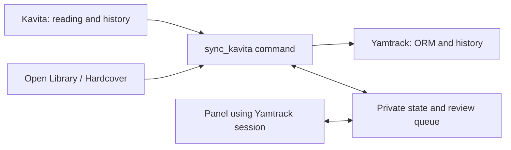

# Kavita → Yamtrack Sync

[](https://github.com/raishack/kavita-yamtrack-sync/actions/workflows/ci.yml)

A **one-way** connector that transfers book and volume reading progress from Kavita to Yamtrack. Kavita remains the reading source; the connector does not modify its library, users, or progress.

**This is not an official Kavita or Yamtrack integration.** It is a Django extension that runs **inside the Yamtrack environment**, using its ORM and providers. It is not a standalone program or an EPUB/CBR file importer.

## Features

- Proportional progress conversion between editions, in-progress/completed states, and dates.
- ISBN matching, title/author/volume matching, and explicit overrides.
- Open Library and Hardcover catalogs through Yamtrack providers.
- Review queue with an authenticated panel: approve, ignore, choose an edition, or search again.
- Provisional manual entries after repeated ambiguous cycles, followed by later reconciliation.
- Multiple accounts with separate Kavita API keys and per-user isolation in the panel.
- Dry-run by default; writes only with `--apply`.
- Strict version guards, transactions, checkpoints, and mutual exclusion.
- Never deletes entries or merges conflicting readings; preserves notes, ratings, and history.
- Optional systemd timer and health endpoints that expose no reading data.



## Compatibility

| Component | Validated versions/environment |
|---|---|
| Kavita | 0.9.0.2 and 0.9.1.4; real history/progress API verified |
| Yamtrack | 0.26.3; 0.26.1 retained as a previously tested version |
| Python | 3.12 or newer, using the dependencies bundled with the Yamtrack image |
| Deployment | Linux + Docker Compose; optional systemd scheduling |

The example configuration explicitly includes both validated Kavita versions. Code defaults remain conservative (0.9.0.2): **use explicit configuration**. Compatibility does not automatically extend to later versions based on version-number similarity. See [controlled upgrades and rollback](docs/UPGRADING.md).

## Installation

Start with the **[step-by-step installation guide](docs/INSTALL.md)**. You need administrative access to the Yamtrack deployment, an existing Yamtrack account for each reader, and one individual Kavita API key per reader stored in a private file.

Recommended sequence: back up → pin the image → mount code/configuration → dry-run → review results → apply → repeat to verify idempotency → enable automation.

```sh
# Inside a deployment prepared according to the guide:
docker exec yamtrack python manage.py sync_kavita --config /run/kavita-yamtrack-sync/config.json
# Only after reviewing the dry-run:
docker exec yamtrack python manage.py sync_kavita --config /run/kavita-yamtrack-sync/config.json --apply
```

## Documentation

- [Installation, Docker, review panel, proxy, and systemd](docs/INSTALL.md)
- [Configuration and matching policy](docs/CONFIGURATION.md)
- [Operations and troubleshooting](docs/OPERATIONS.md)
- [Upgrading Kavita/Yamtrack and rollback](docs/UPGRADING.md)
- [Development, architecture, and testing](docs/DEVELOPMENT.md)
- [Security and privacy](SECURITY.md)
- [Changelog](CHANGELOG.md)

## Important limitations

- It does not sync Kavita bookmarks, files, collections, or notes. It syncs reading progress into Yamtrack book entries.
- It is not bidirectional. It does not reopen a completed reading or automatically interpret rereads.
- A dry-run does not persist database or state changes, but it does query external services and creates/acquires the lock file.
- Bibliographic searches may send title, author, and ISBN to providers. Never publish state, queues, backups, or user diagnostics.
- The review panel shares Yamtrack authentication and database access. Keep it behind the same HTTPS origin and never expose its port directly.
- **It does not require Troop Reader's Kavita image patch.** This extension queries metadata and history, not pages or covers. If you also use [Troop Reader](https://github.com/raishack/troop-reader), follow its compatibility guide separately.

## License

AGPL-3.0-only, consistent with integration into [Yamtrack](https://github.com/FuzzyGrim/Yamtrack). See [LICENSE](LICENSE) and [NOTICE](NOTICE). The project does not distribute API keys, databases, Yamtrack binaries, or book content.
