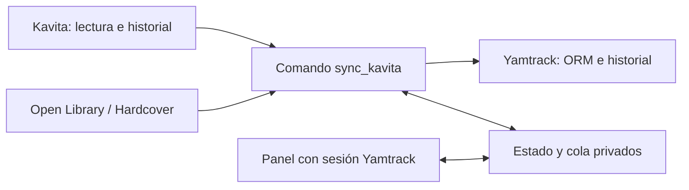

# Kavita → Yamtrack Sync

[](https://github.com/raishack/kavita-yamtrack-sync/actions/workflows/ci.yml)

Conector **unidireccional** para trasladar el progreso de libros y tomos de Kavita a Yamtrack. Kavita es la fuente de lectura; el conector no modifica su biblioteca, usuarios ni progreso.

**No es una integración oficial de Kavita ni de Yamtrack.** Es una extensión Django que se ejecuta **dentro del entorno de Yamtrack**, mediante su ORM y sus proveedores. No es un programa autónomo ni un importador de archivos EPUB/CBR.

## Funciones

- Progreso proporcional entre ediciones, estados en curso/completado y fechas.
- ISBN, coincidencias por título/autor/tomo y overrides explícitos.
- Catálogos Open Library y Hardcover mediante los proveedores de Yamtrack.
- Cola de revisión con panel autenticado: aprobar, ignorar, elegir edición o volver a buscar.
- Ficha manual provisional tras varios ciclos ambiguos y reconciliación posterior.
- Varias cuentas con claves Kavita separadas y aislamiento en el panel.
- Simulación por defecto; escritura únicamente con `--apply`.
- Bloqueo por versión no validada, transacciones, puntos de avance y exclusión mutua.
- No elimina fichas ni fusiona lecturas en conflicto; conserva notas, valoración e historial.
- Timer systemd y endpoints de salud sin información de lecturas.



## Compatibilidad

| Componente | Validación conocida |
|---|---|
| Kavita | 0.9.0.2 y 0.9.1.4; API real de historial/progreso comprobada |
| Yamtrack | 0.26.3; 0.26.1 conservada como versión previamente probada |
| Python | 3.12 o superior, usando las dependencias de la imagen Yamtrack |
| Despliegue | Linux + Docker Compose; systemd opcional para planificar |

La plantilla incluye ambas versiones Kavita explícitamente. Los valores predeterminados del código se mantienen conservadores (0.9.0.2): **usa la configuración explícita**. La compatibilidad no se extiende a versiones futuras por similitud de número. Ver [actualizaciones y reversión](docs/UPGRADING.md).

## Instalación

Empieza por **[Instalación paso a paso](docs/INSTALL.md)**. Requiere acceso de administración al despliegue Yamtrack, una cuenta existente por lector y una clave API individual de Kavita guardada en un archivo privado.

Secuencia: backup → fijar imagen → montar código/configuración → simular → revisar resultados → aplicar → repetir para comprobar idempotencia → habilitar automatización.

```sh
# Dentro de un despliegue preparado siguiendo la guía:
docker exec yamtrack python manage.py sync_kavita --config /run/kavita-yamtrack-sync/config.json
# Solo después de revisar la simulación:
docker exec yamtrack python manage.py sync_kavita --config /run/kavita-yamtrack-sync/config.json --apply
```

## Documentación

- [Instalación, Docker, panel, proxy y systemd](docs/INSTALL.md)
- [Configuración y política de coincidencias](docs/CONFIGURATION.md)
- [Operación y diagnóstico](docs/OPERATIONS.md)
- [Actualizar Kavita/Yamtrack y revertir](docs/UPGRADING.md)
- [Desarrollo, arquitectura y pruebas](docs/DEVELOPMENT.md)
- [Seguridad y privacidad](SECURITY.md)
- [Cambios](CHANGELOG.md)

## Límites importantes

- No sincroniza marcadores, archivos, colecciones ni notas de Kavita: sincroniza progreso hacia fichas de libros en Yamtrack.
- No es bidireccional. No reabre una lectura ya completada ni interpreta automáticamente relecturas.
- La simulación no guarda la base ni el estado, pero consulta servicios externos y crea/adquiere el archivo de bloqueo.
- Las búsquedas bibliográficas pueden transmitir título, autor e ISBN a los proveedores. No publiques estado, colas, backups o diagnósticos de usuarios.
- El panel comparte autenticación/base con Yamtrack; debe permanecer detrás del mismo origen HTTPS y no exponer su puerto directamente.
- **No requiere el parche de imágenes de Troop Reader.** Esta extensión consulta metadatos e historial, no páginas ni carátulas. Si también utilizas [Troop Reader](https://github.com/raishack/troop-reader), sigue su guía de compatibilidad por separado.

## Licencia

AGPL-3.0-only, coherente con la integración en [Yamtrack](https://github.com/FuzzyGrim/Yamtrack). Consulta [LICENSE](LICENSE) y [NOTICE](NOTICE). No se distribuyen claves, bases de datos, binarios de Yamtrack ni contenido de libros.
